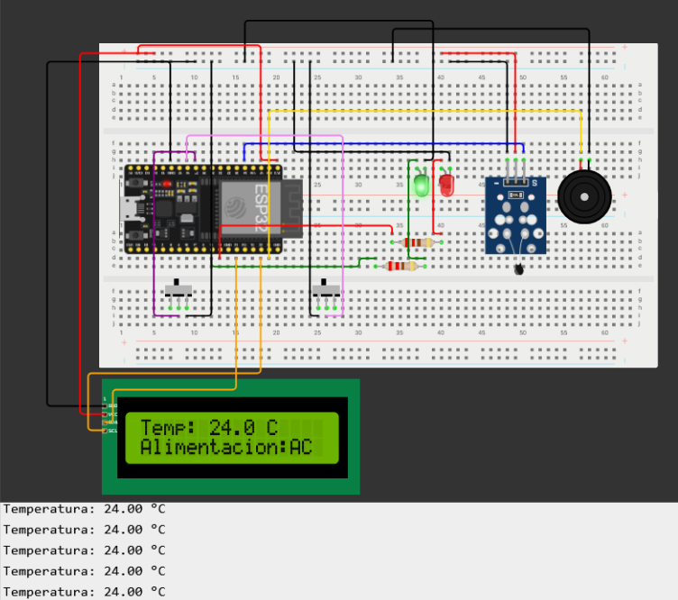
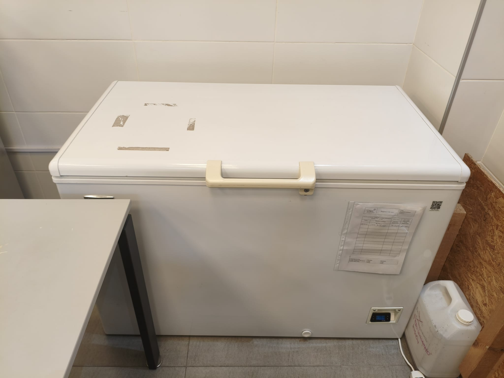

# Sistema de Monitoreo de Freezers - Componente de Hardware

Este repositorio alberga el código fuente del firmware para el dispositivo de adquisición de datos del **Sistema de Monitoreo de Freezers**. El proyecto constituye el trabajo final de grado para la carrera de **Tecnólogo Informático** de la **Universidad Tecnológica (UTEC)**, en conjunto con la **Universidad de la República (UDELAR)** y la **Dirección General de Educación Técnico Profesional (DGETP-UTU)**, Sede Paysandú, Uruguay.

---

## Información del Proyecto

* **Institución:** Universidad Tecnológica (UTEC) - Sede Paysandú

* **Carrera:** Tecnólogo Informático

* **Autores:** Carlos Cardozo, Jhon Guimaraens, Matías Parente

* **Tutores:** Sonia Rocha, Marcelo Scotto

* **Fecha de presentación:** 05/11/2026

---

## Descripción General

En contextos de investigación académica y profesional, la preservación de muestras biológicas y químicas se apoya en el control de ciertas variables ambientales. En entornos de laboratorios, las mencionadas muestras se deben mantener bajo estrictos rangos de temperatura y condiciones de almacenamiento controladas, resultando esto necesario para garantizar la integridad del material, y en consecuencia, la validez y continuidad de las investigaciones.

Ante las deficiencias de comunicación que presenta el equipamiento actual y la necesidad crítica de resguardar las investigaciones de la sede, se evidencia una clara oportunidad para el desarrollo de este proyecto final de carrera. La vulnerabilidad identificada y el riesgo sobre la posible pérdida del material justifican la intervención técnica.

Este repositorio específico aloja el código fuente implementado en Arduino IDE para el dispositivo físico encargado de:

* Implementar un módulo de hardware embebido para la adquisición automatizada de datos térmicos y de estado del freezer, garantizando un método de lectura no intrusivo.

* Desarrollar un mecanismo de detección de fallas operativas, orientado a identificar interrupciones en el suministro eléctrico y pérdidas de conectividad de los dispositivos de campo.

* Transmitir la información recolectada de manera inalámbrica para posibilitar una visualización remota y en tiempo real.

---

## Arquitectura de Hardware (Versión Actual 1.0)

El prototipo actual del dispositivo se construyó empleando recursos proporcionados por la institución UTEC para validar el funcionamiento del sistema antes de migrar a los componentes finales del proyecto.

### Componentes Utilizados en la Versión 1.0:

* **Placa de Desarrollo:** ESP32 DevKit (30 pines).
* **Sensor de Temperatura:** Sensor de temperatura analógico NTC (NTC Temperature Sensor Module), idóneo para mediciones preliminares de control local.
* **Actuador de Alerta Sonora:** Buzzer activo para emitir señales audibles localmente ante desvíos críticos de temperatura.
* **Indicadores Visuales:** Diodos LED (Verde para estado operativo normal y Rojo para señalización de fallas/alertas).
* **Resistencias:** Resistencias de limitación de corriente de $220\,\Omega$ para la protección de los LEDs.
* **Estructura de Montaje Temporal:** Dos placas de pruebas (protoboards) acopladas físicamente, retirando un raíl de alimentación intermedio para facilitar la inserción cómoda y segura del módulo ESP32 DevKit sobre el espacio central de trabajo.

---

## Explicación del Diagrama de Conexión

El diseño de conexiones en protoboard integra elementos de simulación física para emular el comportamiento que tendrá el dispositivo definitivo en producción:

* **Interruptor Deslizable Izquierdo (Simulación de Alimentación):** Funciona para simular un corte de suministro eléctrico de la red de corriente alterna (AC). Posteriormente, en la versión final de producción, este interruptor manual será reemplazado por un relé de 220V o un sensor detector de voltaje AC de 220V que automatice este registro.

* **Interruptor Deslizable Derecho (Simulación de Apertura):** Empleado para simular el estado de apertura y cierre del freezer, lo que permite validar las políticas de acceso autorizado/denegado. En la fase final, esta simulación manual será sustituida por un sensor magnético de contacto (*reed switch*).
* **Pantalla LCD (Simulación de Salida de Datos):** La pantalla de cristal líquido situada en la parte inferior del circuito actúa como simulador de la respuesta del sistema. Permite observar localmente la visualización de datos que se enviarán a la base de datos centralizada (como la temperatura) y emular las notificaciones de alertas y mensajes SMS que el orquestador de eventos enviaría ante anomalías de alimentación o lecturas fuera de rango.

---

## Estructura del Repositorio

* `/CodigoDispositivoArduinoIDE`: Contiene el archivo de código principal editable desde el entorno de Arduino IDE.
* `/Fotos`: Carpeta de registros gráficos que documenta la evolución física de la solución.

---

## Galería del Proyecto

A continuación se detalla el registro visual del desarrollo físico de la solución, los diagramas de conexión y las instalaciones asociadas:

### Equipo de Desarrollo del Proyecto

Fotografía de los integrantes durante el proceso de diseño y ensamblaje de la solución de hardware:

### Diagrama de Conexión del Dispositivo

Esquema de distribución hecho en **Wokwi** sobre protoboard acoplada del módulo ESP32, sensor analógico NTC, buzzer, resistencias, switches de simulación y pantalla LCD:

### Prototipo en Desarrollo

Primeras pruebas conceptuales de conexionado y adquisición de datos utilizando una placa de pruebas (protoboard):

### Versión Consolidada del Dispositivo (v1.0)

Montaje del módulo sensor y demas componentes proporcionados por la universidad:

### Congelador Biomédico Objeto de Monitoreo

Equipo Haier DW-25W388 ubicado en los laboratorios de la sede Paysandú, donde se instaló la solución:

### Lector de temperatura local en el freezer

La pantalla integrada en la sección inferior del freezer biomédico:

### Interior del Freezer Biomédico

Distribución interna del compartimiento de almacenamiento horizontal donde se suspende provisionalmente el sensor:

---

## Requisitos de Controladores (Drivers)

Para establecer comunicación entre su computadora y la placa de desarrollo ESP32 DevKit a través del puerto serie USB, es indispensable instalar el controlador adecuado según el chip conversor USB-to-UART incorporado en su placa:

* **CH340 / CH341 USB-to-Serial Driver:** Requerido si su módulo incorpora el circuito de comunicación serie de la serie CH34X.
* **CP210x USB to UART Bridge VCP Drivers:** Requerido si su módulo integra la interfaz de comunicación de Silicon Labs.

*Nota: Una vez instalados los controladores e identificada la placa mediante el Administrador de Dispositivos de su sistema operativo en un puerto COM específico, podrá interactuar con el dispositivo mediante Arduino IDE.*
